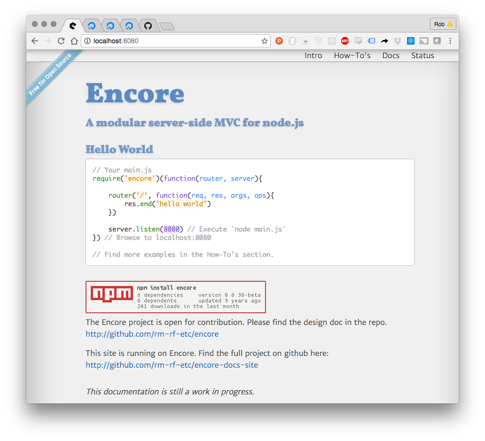

encore-docs-site
================

This is a website you can serve using encore.js. It has basic documentation of the encore.js framework, an MVC project I built while still new to node.js. It's no longer available on nodejitsu, but I'll soon have it up somewhere else.

If you clone [rm-rf-etc/encore](http://github.com/rm-rf-etc/encore) you can use `npm link` to include it via node_modules to run this project. Last tested on node 6.8.1.

